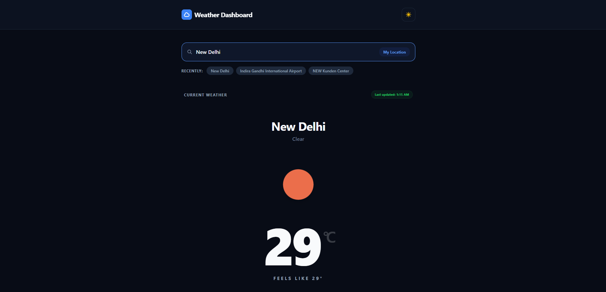
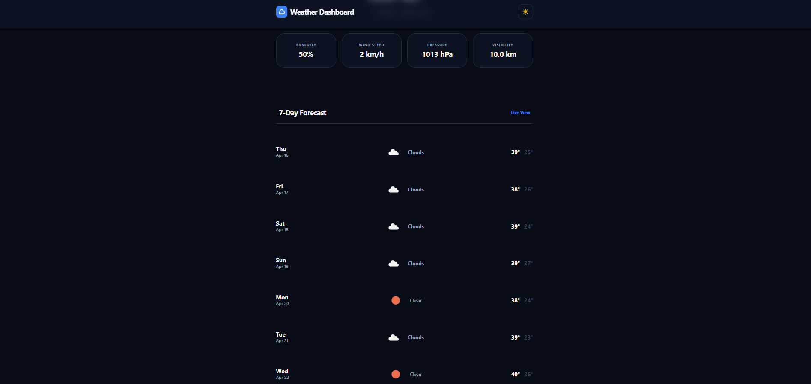

# 🌦️ WeatherPro – Real-Time Weather Forecast App


---

## 📌 Overview

**WeatherPro** is a modern, clean, and responsive weather forecasting web application that provides **real-time global weather data** and **7-day forecasts**.

The project focuses on **clean architecture, API integration, and user-centric design**, making it a strong demonstration of frontend development skills.

---

## ✨ Features

* 🔍 **Global City Search** – Search weather for any city worldwide
* 📍 **Auto Location Detection** – Fetch weather using browser geolocation
* 🌡️ **Real-Time Weather Data** – Temperature, humidity, wind, pressure, visibility
* 📅 **7-Day Forecast** – Daily weather with min/max temperature
* 💾 **Recent Searches** – Stored using localStorage
* 🌗 **Dark Mode Support** – Clean UI with toggle support
* ⚠️ **Error Handling** – Graceful handling of invalid inputs & API errors

---

## 🛠️ Tech Stack

* **Frontend:** React.js (Functional Components & Hooks)
* **Styling:** Tailwind CSS
* **Build Tool:** Vite
* **State Management:** Context API
* **API:** OpenWeatherMap API

---

## 📂 Project Structure

```text
src/
 ├── components/   # Reusable UI components
 ├── pages/        # Page-level components
 ├── context/      # Global state management
 ├── utils/        # API and helper functions
 ├── App.jsx       # Routing & layout
 └── main.jsx      # Entry point
```

---

## 🧠 Key Technical Highlights

* **Separation of Concerns:** UI and business logic are properly separated
* **Context API:** Used for centralized weather state management
* **Debounced Search:** Optimized API calls for better performance
* **Real-Time API Integration:** Dynamic data fetching from OpenWeatherMap
* **LocalStorage Usage:** Persisting recent searches for better UX

---

## 🚀 Live Demo

👉 https://weather-forecast-tawny-iota.vercel.app/

---

## 📸 Screenshots

### 🏠 Home Page



### 📊 Forecast Section



---

## ⚙️ Setup Instructions

1. Clone the repository:

```bash
git clone https://github.com/your-username/weatherpro.git
```

2. Navigate to project folder:

```bash
cd weatherpro
```

3. Install dependencies:

```bash
npm install
```

4. Add your API key:

```bash
VITE_API_KEY=your_api_key_here
```

5. Run the project:

```bash
npm run dev
```

---

## 👨‍💻 Author

**Rohit Maddheshiya**

---

## ⭐ Support

If you found this project helpful, consider giving it a ⭐ on GitHub!
